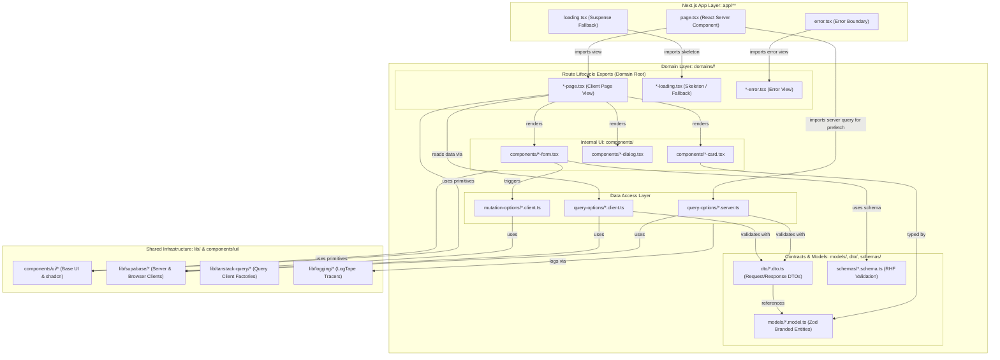
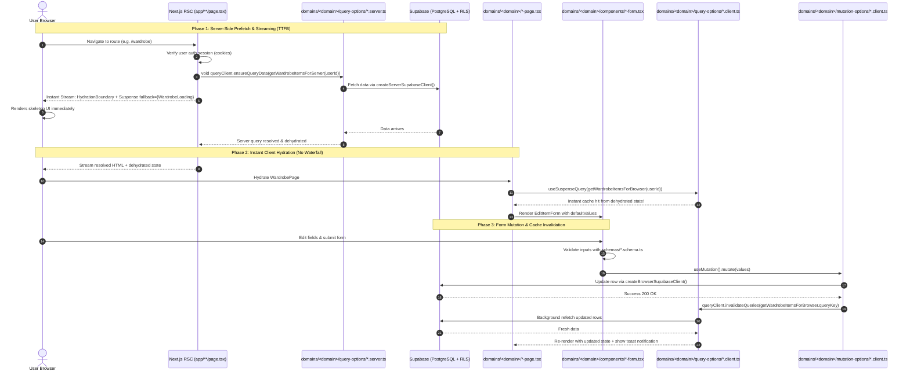

# ADR 0005: Flat Domain Architecture and Route Component Lifecycle

**Status:** Accepted  
**Date:** 2026-09-30

## Context

Previously, feature logic was located under `components/features/<feature>`, while domain utilities were scattered in `lib/` and `types/`. Within feature directories, route-level page views (e.g. `wardrobe-view.tsx`) were co-located flat with internal form components (e.g. `edit-item-form.tsx`), obscuring which components represented route entry points versus internal UI widgets.

We evaluated two architectural alternatives:

1. **Granular micro-features (`features/<action>`)**: High isolation per action, but introduces "shared logic anxiety"—ongoing confusion over where shared cards, filters, and query options across the same domain should live.
2. **Deeply nested corporate modules (`domains/<domain>/views/<name>/hooks/...`)**: High domain cohesion, but introduces 4–5 directory levels of navigation friction for small single files.

## Decisions

1. **Top-level `domains/<domain>` packaging.**
   Business entities, workflows, and data access are organized under root `domains/<domain>/` (e.g. `domains/wardrobe`, `domains/trip`, `domains/profile`, `domains/outfit`, `domains/onboarding`). The term "domain" is chosen over "module" to emphasize business-bounded contexts and avoid ambiguity with JavaScript/Node module concepts.

2. **Flat domain depth cap (maximum 2 directory levels).**
   Within each domain, nesting is capped at 2 levels:
   - `models/`: Zod domain entity schemas and branded types (e.g. `wardrobe-item.model.ts`).
   - `dto/`: Zod request and response data transfer objects (e.g. `get-wardrobe-items.dto.ts`).
   - `query-options/`: Strict client/server query split (`*.query-option.client.ts` and `*.query-option.server.ts`).
   - `mutation-options/`: TanStack Query mutation options (`*.mutation-option.client.ts`).
   - `schemas/`: React Hook Form Zod validation schemas (`*.schema.ts`).
   - `components/`: Internal widgets, forms, dialogs, and cards (e.g. `edit-item-form.tsx`, `wardrobe-item-card.tsx`).
   - `hooks/`: Domain-level custom hooks (flat, not nested).

3. **Route Component Lifecycle Symmetry (`*-page.tsx`, `*-loading.tsx`, `*-error.tsx`).**
   To mirror Next.js App Router conventions 1:1, route-facing components are named after their route role and sit at the root of the domain:
   - `*-page.tsx` $\leftrightarrow$ `app/**/page.tsx` (the client page body rendered inside the RSC)
   - `*-loading.tsx` $\leftrightarrow$ `app/**/loading.tsx` (the streaming skeleton / `<Suspense fallback>`)
   - `*-error.tsx` $\leftrightarrow$ `app/**/error.tsx` (error boundary view)

   `app/` routes only import these route-facing files and `query-options/` for server prefetching. Internal forms, dialogs, and cards remain private to `domains/<domain>/components/`.

4. **Cross-cutting infrastructure remains in `lib/`.**
   `lib/` is strictly reserved for infrastructure and third-party adapters (`lib/supabase/`, `lib/tanstack-query/`, `lib/logging/`, `lib/ai/`, `lib/utils.ts`), never domain entities.

## Visual Architectural Flows

### 1. Import Dependency Flow (Unidirectional)

Dependencies flow strictly downward. Page routes only import domain root components and server queries; internal components and schemas remain private to the domain.

### 2. Runtime Data Flow (RSC Streaming to Mutation)

Illustrates the end-to-end lifecycle: server-side unawaited prefetch, instant streaming skeleton, client hydration cache hit, and mutation invalidation.

## Considered Options

- **Granular Feature Slicing (`features/<action>`)**: Rejected due to the "shared junk drawer" problem where domain entities (like wardrobe items or category selectors) must be accessed by multiple sub-features.
- **Deeply Nested Views (`views/<name>/hooks/<hook>.hook.ts`)**: Rejected to avoid cognitive fatigue and excessive folder depth on a fast-shipping product.
- **"modules" vs "domains" naming**: Selected "domains" to directly align with Domain-Driven Design terminology and project ubiquity.

## Consequences

- Domain cohesion is preserved: all queries, mutations, models, and shared components for a domain reside in one folder.
- Navigation remains fast and shallow (max 2 levels deep).
- Next.js route integration has a clear contract (`page.tsx` imports `*-page.tsx` and `*-loading.tsx`).
